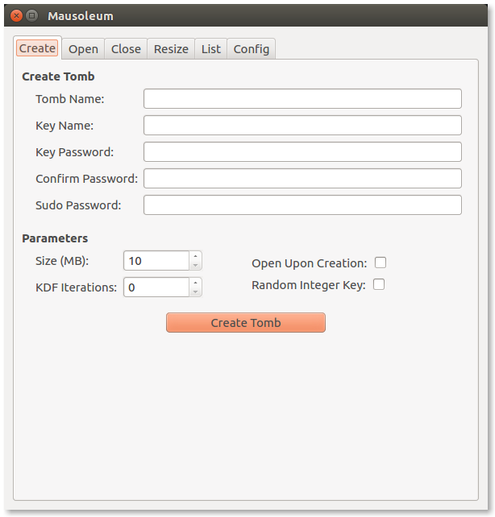

|travis| |coveralls| |dependency| |codacy| |pypiversion| |pypistatus| |pythonversion| |pypiformat| |license|

Mausoleum consists of a command line application and GUI application wrapped around Tomb
(the Crypto Undertaker). Both applications were created with the intention of making
it easier for users to interact with Tomb.

************
Installation
************

As Mausoleum is purely a wrapper for Tomb, it requires Tomb to be installed locally. For Tomb installation
details, please see: https://www.dyne.org/software/tomb/. The Mausoleum GUI application requires PyQt5
to be installed locally. For PyQt5 installation instructions, please visit: https://www.riverbankcomputing.com/software/pyqt/download5.

With your environment set, the following command may be used to install Mausoleum::

    $  pip install mausoleum

If you would rather install from source, run::

    $  git clone https://github.com/mandeep/Mausoleum.git
    $  cd Mausoleum
    $  python setup.py install

***************
GUI Application
***************

To run the GUI application, simply run the following command in a terminal::

    $  mausoleum-gui

The command will open a new window that includes tabs that group Tomb functions into separate
tabs. The 'Create' tab receives information needed to create a new tomb, the 'Open'
tab allows the user to fill in information regarding the opening of an existing tomb,
and the 'Close' tab lets the user close opened tombs, the 'List' tab displays all active tombs,
and the 'Config' tab allows the user to make configuration changes to the GUI.

************************
Command Line Application
************************

With Mausoleum installed, the command line application can be invoked with the following commands and arguments::

    usage: mausoleum [options] command [arguments]

    commands:
        construct               Dig, forge, and lock a new tomb 
        enter                   Open an existing tomb
        alter                   Resize an existing tomb

    positional arguments:
        name                    Name of the new or existing tomb
        size                    The size in megabytes for the new tomb
        key                     Name of the new or existing tomb key file

    optional arguments:
        --open                  Option that opens a tomb after creation or resizing

If a key is not supplied as a command line argument, the application will search for a key with
the name of the tomb with .key as the suffix.

Example of creating a new tomb and opening it thereafter::

    $  mausoleum construct --open secret.tomb 100
    Password:
    Repeat for confirmation:

Example of opening an existing tomb::

    $  mausoleum enter secret.tomb
    Password:

*******
Wrapper
*******

Mausoleum may be imported as a module as seen in the following example:

.. code:: python

    import mausoleum.wrapper

    def batch_create_tombs(names, size, password):
        """Take a list of names and batch create tombs."""

        for name in names:
            key = '{}.key' .format(name)
            mausoleum.wrapper.dig_tomb(name, size)
            mausoleum.wrapper.forge_tomb(key, password)
            mausoleum.wrapper.lock_tomb(name, key, password)

*************
Contributions
*************

All contributions are welcome! Feel free to submit a pull request for trivial
changes. For other changes, please open an issue on the repository's issue tracker.

.. |travis| image:: https://img.shields.io/travis/mandeep/Mausoleum.svg 
    :target: https://travis-ci.org/mandeep/Mausoleum
.. |coveralls| image:: https://img.shields.io/coveralls/mandeep/Mausoleum.svg 
    :target: https://coveralls.io/github/mandeep/Mausoleum
.. |dependency| image:: https://img.shields.io/librariesio/github/mandeep/Mausoleum.svg
    :target: https://dependencyci.com/github/mandeep/Mausoleum
.. |codacy| image:: https://img.shields.io/codacy/grade/78a599f30d32444a98ba8a172edbed3d.svg 
    :target: https://www.codacy.com/app/bhutanimandeep/Mausoleum
.. |pypiversion| image:: https://img.shields.io/pypi/v/mausoleum.svg 
    :target: https://pypi.python.org/pypi/mausoleum/
.. |pypistatus| image:: https://img.shields.io/pypi/status/mausoleum.svg 
    :target: https://pypi.python.org/pypi/mausoleum/
.. |pythonversion| image:: https://img.shields.io/pypi/pyversions/mausoleum.svg 
    :target: https://pypi.python.org/pypi/mausoleum/
.. |pypiformat| image:: https://img.shields.io/pypi/format/mausoleum.svg
    :target: https://pypi.python.org/pypi/mausoleum/
.. |license| image:: https://img.shields.io/pypi/l/mausoleum.svg
    :target: https://pypi.python.org/pypi/mausoleum/